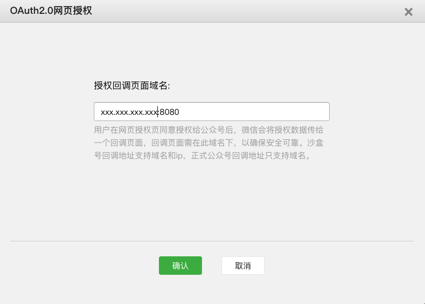

# 微信网页授权 in Spring Boot

[Official Documentation](https://mp.weixin.qq.com/wiki?t=resource/res_main&id=mp1421140842)

#### STEP 1. Request user's authorization, then get a auto-generated code from user. 
1. **Set authorization redirect domain in WeChat official account(公众号)**
<br/>There are two types of WeChat: *Subscription Account(订阅号)* and *Service Account*. 
However, only service accounts are able to set the domain. But if you don't have an account or you 
have a subscription account, WeChat offers ways to set it.
    1. For Service Account:
        
          Log in the account, go to ```[公众号设置] -> [功能设置] -> [授权回调域名]```
    2. For Subscription Account:
    
          Log in the account, go to ```[开发]->[开发者工具]->[公众平台测试账号]->[网页授权获取用户基本信息]->[修改]```
          
    3. Sandbox Account / Test Account (for people who have no Official Account)
          
          Go to [here](https://mp.weixin.qq.com/debug/cgi-bin/sandbox?t=sandbox/login),
          scan to log in. Go to ```[网页授权获取用户基本信息]->[修改]```
          
    Then you'll see this place to set a domain:
     
     
    
    **Note:** If you're using subscription account, you have to get an official domain. For example you
    can get an domain from NATAPP which is projected to your ip address. 
    
    I'm talking about Sandbox account here. The Sandbox account accept ip address and domain name. If you're using
    ip address here, don't use 127.0.0.1:8080, use local ip instead. You can find the local ip by command ```ifconfig```. 
    
    ***Pattern:::***
        
        If your domain is www.test.com, just type "www.test.com". Don't add http:// before the string. 
        
     or
        
        If you're using ip address, enter "xxx.xxx.xxx.xxx:8080", replace xxx with your ip address. 
        
2. **Write weChatController to get authorization and get code**
    1. According to official documentation:
           
           If we want to get the code, we need to let the user open a url 
           "https://open.weixin.qq.com/connect/oauth2/authorize?appid=APPID&redirect_uri=REDIRECT_URI&response_type=code&scope=SCOPE&state=STATE#wechat_redirect"
    This url requires appid, redirect_uri and scope. Once we get all the params and complete the url, we let the user open this url, the webpage
    will be redirected to the redirect_uri, and the code would be returned with the redirection.         
    
    2. Write a method to get code
    
    ```java
    @RestController
    @RequestMapping("/weixin")
    @Slf4j // log
    public class WeChatController {
    
        @GetMapping("/auth")
        public void auth(@RequestParam("code") String code) {    // The code will be return in the 
            log.info("GO TO auth METHOD...");
            log.info("code = {}", code);
        }
    ```
   
   **Run the code**.
   
    For my case, the redirect_uri is ```http://10.0.0.92:8080/sell/weixin/auth```.
    
 3. **Build url, let user to open it.** 
 
    For my case , the url is ```https://open.weixin.qq.com/connect/oauth2/authorize?appid=wxafafbd714ab6aed6&redirect_uri=http://10.0.0.92:8080/sell/weixin/auth&response_type=code&scope=snsapi_base&state=STATE#wechat_redirect```
    . I send this url to my cellphone end, and open it inner the weChat. The opened page is a blank page, 
    if I check the IDE consle, I can find the returned code. So far so good.
    

        
 